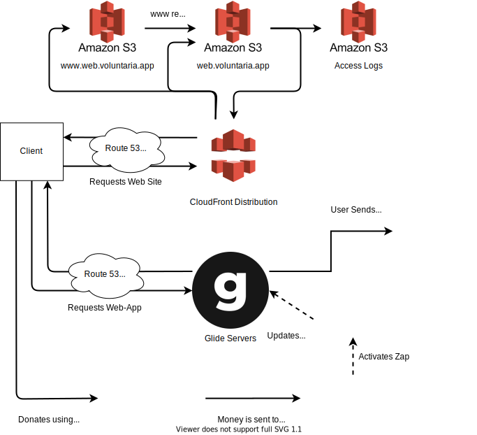

# VoluntarIA

## Overview

## Architecture

### Catalan

VoluntàrIA és una plataforma que vota per l'ajuda organitzada enfront la crisi del COVID-19. Ofereix una aplicació que proporciona informació detallada sobre les ONGs que l'usuari té a prop i permet realitzar donacions de forma senzilla i segura. A més, fa possible una comunicació senzilla entre usuaris i ONGs en cas de que es vulgui participar activament amb l’entitat.

### English

VoluntàrIA it's a platform that vows for organized help against the COVID-19 crisis. It offers a web application that gives detailed information about NGOs and non-profits close to the user, allowing them to donate, volunteer and contact these entities on the touch of a button. All the payments are secured using Stripe and Google's Technology.

## Architecture

### Web-App

The application was developed using the Glide platform,
which allows to deploy an app to the market in record
time. It connect to a private Google Sheets that contains
information about volunteering organizations. We connected
our Stripe account to allow for payments, which arrives at
our bank account which is an US-based account through
TransferWise.

The design and view model has been based upon this Glide template:
[COVID-19 Template](https://go.glideapps.com/app/covid-19-toronto-template).

### User Content

The application allows for potential volunteers to upload
pictures. These are stored in the Google Cloud Storage
platform. This was not our decision, but how the Glide platform
operates.

### Website Hosting

All the website pages are hosted in S3 buckets. The following
buckets are used:

1. A main S3 bucket where the main static site is stored.
1. A second S3 bucket that is used for forwarding (www subdomain
to the main domain).
1. A third and final S3 bucket configured to store all the other
S3 bucket logs plus the CDN logs generated by the CloudFront
distribution.

#### Global Distribution

AWS CloudFront is used for site replication and cache for fast 
web content delivery. This allows for robustness, speed, and better
SEO.

### DNS Servers

The DNS servers are managed through Hosted Zones in AWS Route 53.

### Live-updates from COVID-19

Right now we are using Python + BeautifulSoup to scrape information
of the COVID-19 pandemic. If the demand for our project increase we
are thinking of using Scrapy (or maybe Scrapinghub) to meet the
potential demands.

## Contributing

We follow the 
[Conventional Commits convention](https://www.conventionalcommits.org/en/v1.0.0-beta.4/)
and the
[Angular Styleguide](https://angular.io/guide/styleguide) when it
comes to how we organize our project--of course, only where it makes
sense, since this project is not a whole Angular application (yet),
so there is no Javascript, Typescript or Angular modules for example;
but this does not mean that we do not follow principles such as T-DRY,
LIFT or the folders-by-feature structure.

